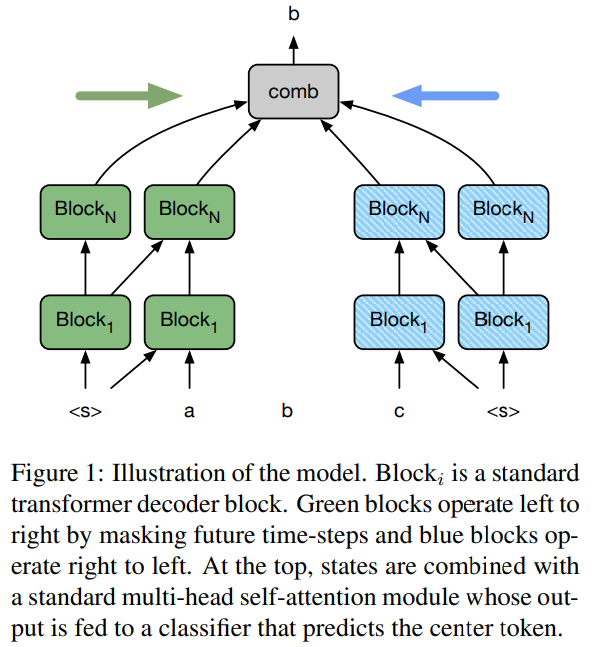
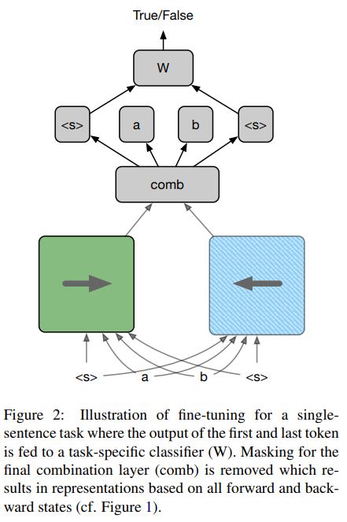
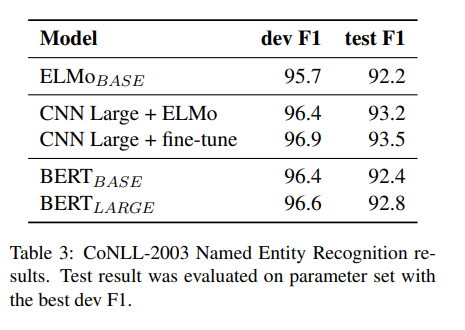

# Cloze-driven Pretraining of Self-attention Networks

## Abstract

- 양방향 모델의 새로운 접근방법 제시
- cloze-style의 reconstruction task
- NER에서 새로운 sota

## 1. Introduction

- self-attention cloze model의 양방향 학습
- taining data안에서 모든 token들을 예측

	

- Blocki는 standard transformer decoder block

    

- 녹색 block은 left to right, 파란 블록은 right to left
- top에서는 standard multi-head self-attnetion module로 합쳐짐
- model은 left-to-right와 right-to-left representation이 주어졌을때 center word를 예측해야함
- model은 각각 masked self-attention 구조로 forward, backward 상태를 계산함
- 마지막으로 top에서는 combined 되고 가운데 word를 예측함

## 2. Related work

- 접근 방식은 대부분 GPT(generating pretraining)를 따름

: 언어모델을 다양한 미분류 말뭉치로 생성적 사전학습(generative pre-training)을 시킨 후 각 특정 과제에 맞춘 세부조정(fine-tuning) 과정을 거쳐 가능하다.

- NER에서 ELMO module이랑도 좋은 성능을 냄
- BERT와 다른점 :

1) 이 모델은 sequence안에 모든 token들을 예측한다. 하지만 BERT는 denoising autoencoder과 유사masked된 input token들의 subset예측과 다음 문장 예측을  multi로 함

2) 그리고 이 모델은 각 토큰의 sing loss function 을 최적화 한다. 모든 토큰이 training targets이어서 모든 single token으로부터 learning signal을 뽑아낸다. 

이 모델은 denoising task를 다루지 않는다.

## 3. Two tower model

- 각 문장의 cloze model probability distribution :

- n tokens t1, ..., tn.
- 각 N block에서 두개의 self-attentional towers가 있음 : forward tower, backward tower
- 그리고 token을 예측하기 위해서 two towers representation을 합침
- forward tower는 self-attention으로 이전 layer의 representation에 기초하여 현재layer에서 i token의 representation을 계산함	
    
    

- bacword tower는 반대방향으로 현재 layer , i token을 이전 layer로 구함
	
    
## 3.1 Block structure

- 각각의 block은 2개의 sub-block으로 이루어짐:

1)  multi-head self-attention module, H=16 heads

2)  feed-forward module(FFN)

- layer normalization을 self-attention, FFN block 이전에 적용함 → 성능이 더 좋음
- sub-blocks 은 residual connection으로 이어져있음
- Position은 sinusoidal position embedding으로 encode되고 word embedding은  character CNN encoding함

## 3.2 Combination of representations

- forward and backwoard representations는 제거된 단어를 예측하기 위해서 combine된다
- 합치기 위해서 self-attention module을 사용
- FFN block의 결과는 V 클래스
- model이 token i 를 예측할때 , attention module로 들어가는 input은

(n은 sequence 길이, L은 layer 개수)

- 따라서 token i의 attention query 는
	
    
    의 combination임

- base model : sumf the two representation , larger models : concatenated
- 이 모듈의 output은 center token을 예측하는 classifier로 들어감
- output classifier: word based model은  adaptive softmax를 사용하였고 , BPE based model은 regular softmax를 사용함

## 4  Fine-tuning

( W : task-specific classifier)

### classification

- < s > : 문장의 시작과 끝
- output dimension : 1024 , 이거를  concatenate 시킴  ( 나중에 class C개의 개수로 projection)

- output은 softmax-normalized되고 model은 cross-entropy로 optimize

## Experiments

## Results

- biLSTM-CRF with two modifications :

1) 1 biLSTM

2) linear projection layer was added between the token embedding and biLSTM layer

: projection - biLSTM - CRF 가 best result ( pretrained model lr = 1e-05 , pbc lr =1e-03 )